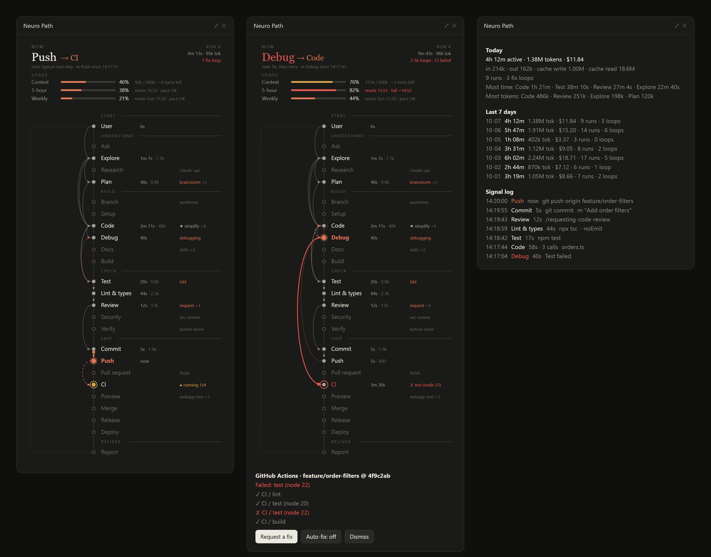
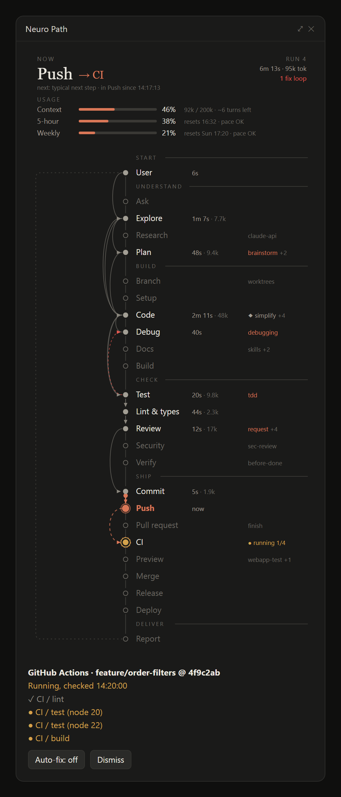
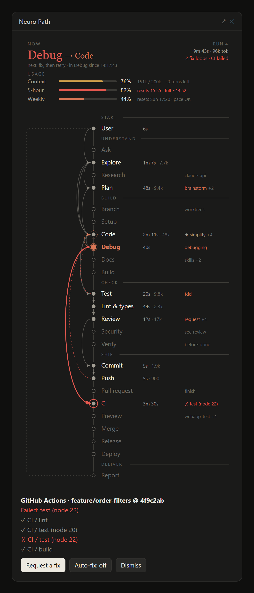

<div align="center">

# Neuro Path

**A live pipeline map for Claude Code.**
See which stage your session is in, where it goes next, what each step cost, when CI breaks, and how close you are to your usage limits.

[](https://github.com/raven-clown/neuro-path/actions/workflows/validate.yml)
[](https://github.com/raven-clown/neuro-path/actions/workflows/codeql.yml)
[](https://github.com/raven-clown/neuro-path/releases)
[](LICENSE)
[](https://docs.claude.com/en/docs/claude-code)



</div>

## Why

A long coding session moves through a lot of steps: reading the code, planning, editing, running tests, fixing what broke, reviewing, committing, pushing, waiting on CI. From the transcript alone it is hard to tell where you are, how many times a step had to be redone, or what a run actually cost.

Neuro Path draws that as a map in a side pane. Each stage is a node, every move between stages is a line with an arrow, and lines that skip stages or loop back for a fix show up exactly as they happened.

## What you get

**The pipeline, live.** 25 stages in five phases, from the prompt to the report that comes back to you:

| Phase | Stages |
| --- | --- |
| Understand | Ask, Explore, Research, Plan |
| Build | Branch, Setup, Code, Debug, Docs, Build |
| Check | Test, Lint & types, Review, Security, Verify |
| Ship | Commit, Push, Pull request, CI, Preview, Merge, Release, Deploy |
| Deliver | Report, then back to User |

- A live strip above the map runs at frame rate without ever reloading: the current stage breathes, a clock counts the time in it, and a signal travels in from the previous stage at a speed set by how long that stage really took.
- A dashed arrow points at the stage that most likely comes next, based on the routes this session has already taken.
- Stages light up the moment the step is decided, not after it finishes, so a question waiting for your answer or a command waiting for approval shows as the current stage.
- A failed test, build, lint, push or CI run draws a red dashed line back to Debug, then on to Code, and the next arrow points at the step to retry.
- Every row shows the real time spent and the tokens used in that stage.

**Usage, with a forecast.** Context window fill, the 5-hour and weekly limits, when each one resets, and whether your current pace runs out before the reset (`full ~14:52` in red) or not (`pace OK`).

**GitHub Actions without watching the tab.** After a push or a new pull request the pane follows the workflow runs for that commit, job by job. When a job fails you get a toast, the map bounces to Debug, and one button asks the session to read that job's log and fix the cause. An optional auto-fix switch does that without waiting for you. The request carries only the run id, branch, commit and job name; the log itself is read as a tool result and treated as data, and nothing is committed or pushed unless you asked for it.

**Daily totals.** Active time, tokens split into input, output and cache, cost, runs, fix loops, and the stages that took the most time and tokens. The last 30 days are kept on your machine; the pane shows the last 7.

**Skills at every stage.** Each stage has skills assigned to it: brainstorming and writing-plans for Plan, test-driven-development for Test, systematic-debugging for Debug, code review for Review, verification-before-completion for Verify, webapp-testing for Preview, and more. With `Stage skills: on`, every coding task is told which installed skill to use at which point, and a failed step asks for systematic debugging before any fix. The map lights each skill as it is used. You can also pin any other skill to a stage, for example `/simplify` after Code.

<table>
<tr>
<td width="50%"></td>
<td width="50%"></td>
</tr>
<tr>
<td align="center">A run in progress, CI checking the push</td>
<td align="center">A failed CI job sends the run back to Debug</td>
</tr>
</table>

## Install

Neuro Path is a Claude Code plugin, published from this repository as a plugin marketplace.

```
/plugin marketplace add raven-clown/neuro-path
/plugin install neuro-path@neuro-path
```

The same marketplace carries the skill packs the stages use, so everything works right away:

```
/plugin install superpowers@neuro-path
/plugin install pr-review-toolkit@neuro-path
/plugin install security-guidance@neuro-path
/plugin install webapp-testing@neuro-path
```

| Pack | Stages | Source |
| --- | --- | --- |
| superpowers | Plan, Branch, Code, Test, Debug, Review, Verify, Pull request | [obra/superpowers](https://github.com/obra/superpowers) |
| pr-review-toolkit | Review | [anthropics/claude-plugins-official](https://github.com/anthropics/claude-plugins-official/tree/main/plugins/pr-review-toolkit) |
| security-guidance | Security | [anthropics/claude-plugins-official](https://github.com/anthropics/claude-plugins-official/tree/main/plugins/security-guidance) |
| webapp-testing | Preview | [anthropics/skills](https://github.com/anthropics/skills/tree/main/skills/webapp-testing) |

The packs are installed straight from their own repositories, pinned to a reviewed commit. Neuro Path works without them; the stages simply have no skill to ask for.

Restart the session, then open the pane any time with:

```
/neuro
```

### Requirements

- Claude Code **2.1.286 or newer** (the plugin uses function hooks and pane rendering from that release). Check with `claude --version`.
- The desktop app draws the full map. The terminal shows a compact text version.
- For CI tracking: the [GitHub CLI](https://cli.github.com/) signed in (`gh auth status`) and a repository whose `origin` is on GitHub.

## How stages are detected

Detection is based on the tools a session calls and the commands it runs. A few examples:

| Stage | Triggered by |
| --- | --- |
| Explore | `Read`, `Grep`, `Glob`, read-only shell commands such as `ls`, `cat`, `git status` |
| Plan | plan mode, early task lists, `brainstorming`, `writing-plans` |
| Code / Docs | `Edit` and `Write`; Markdown and `docs/` files count as Docs |
| Test | `pytest`, `jest`, `vitest`, `npm test`, `go test`, `cargo test` and similar |
| Lint & types | `eslint`, `tsc`, `ruff`, `mypy`, `clippy`, `plugin validate` |
| Commit / Push / PR | `git commit`, `git push`, `gh pr create` |
| CI | `gh run`, `gh pr checks`, and the built-in GitHub tracker |
| Preview | browser pane actions, `curl` to localhost |

The full rules, including what counts as a failure and what is ignored, are in [docs/how-it-works.md](docs/how-it-works.md). If a step lands in the wrong stage, please [open a stage detection issue](https://github.com/raven-clown/neuro-path/issues/new?template=stage_detection.yml).

## Privacy

Everything stays on your machine. The plugin reads session events through the plugin API, keeps its numbers in Claude Code's local plugin store, and only runs `git` and `gh` locally for CI tracking. Nothing is sent anywhere else.

## Roadmap

- GitLab pipelines through `glab`
- Custom stage rules per project
- Export of daily totals to CSV
- A compact band above the prompt for people who keep the pane closed

Ideas and votes are welcome in [Discussions](https://github.com/raven-clown/neuro-path/discussions).

## Contributing

Bug reports, detection fixes and new ideas are all useful. Start with [CONTRIBUTING.md](CONTRIBUTING.md); it covers running the plugin from a local clone with hot reload, validating it, and the pull request flow.

## License

[MIT](LICENSE)
